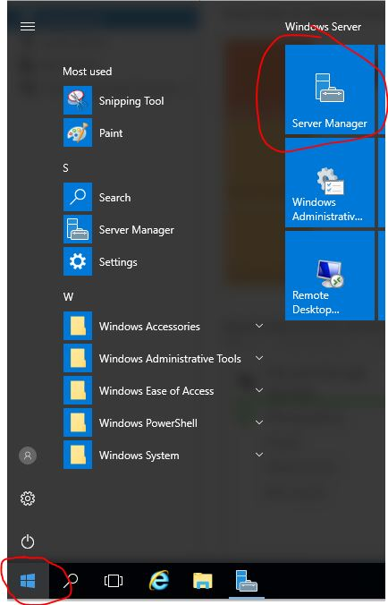
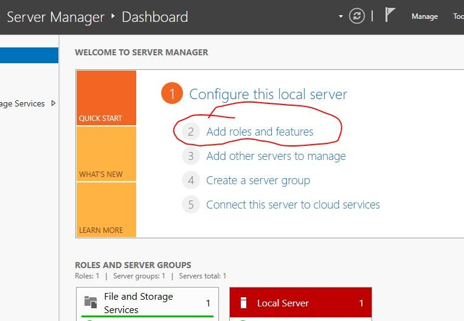
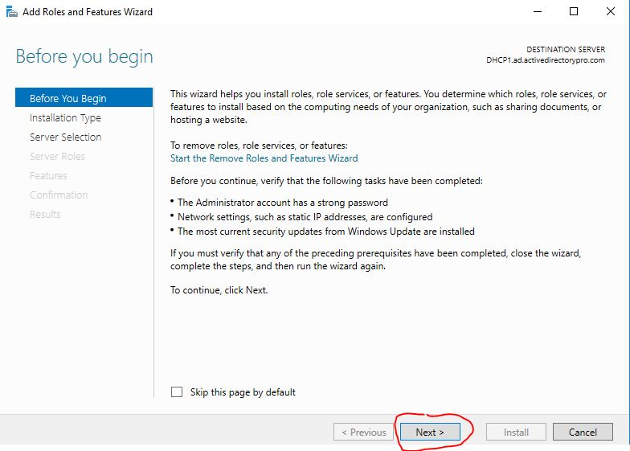
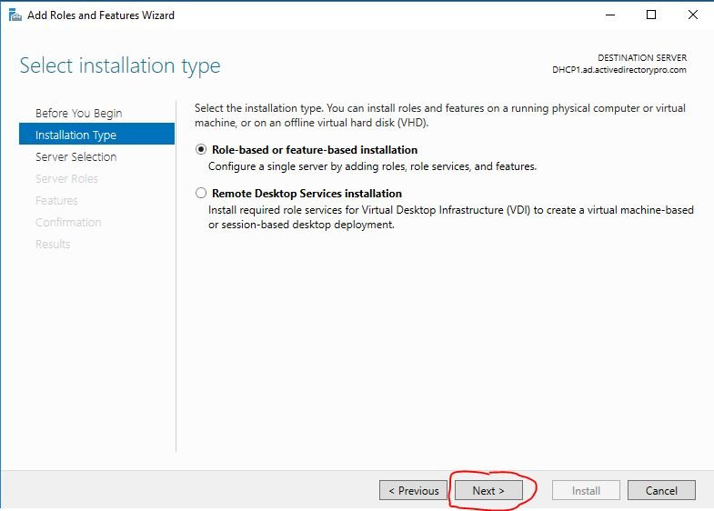
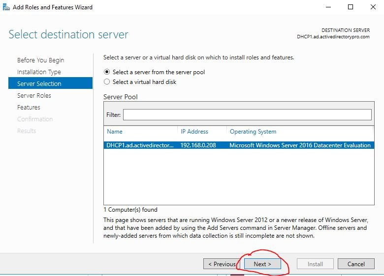
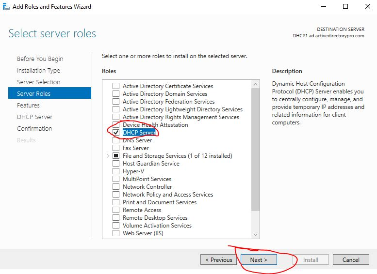
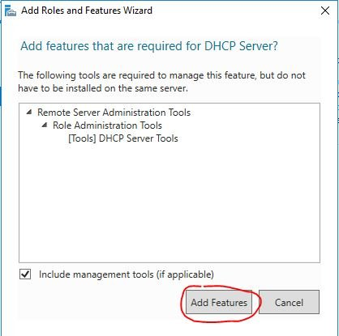
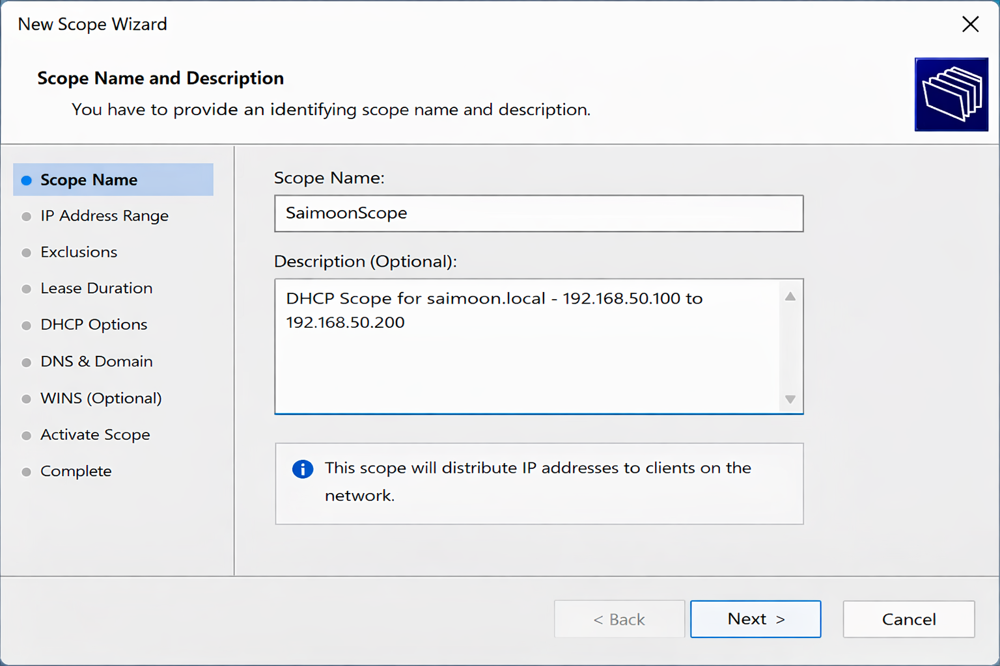
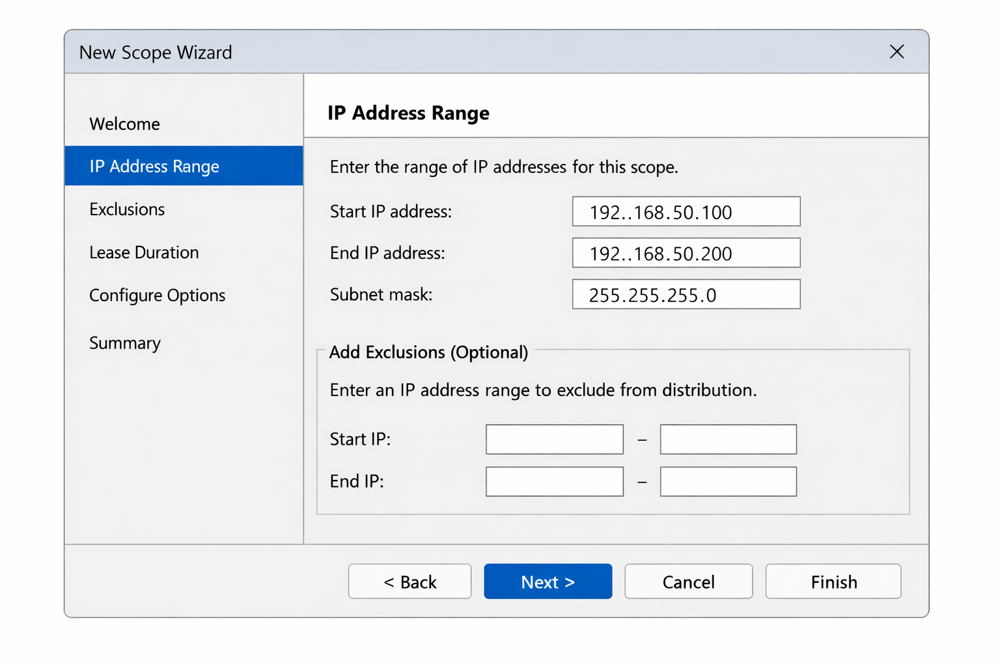
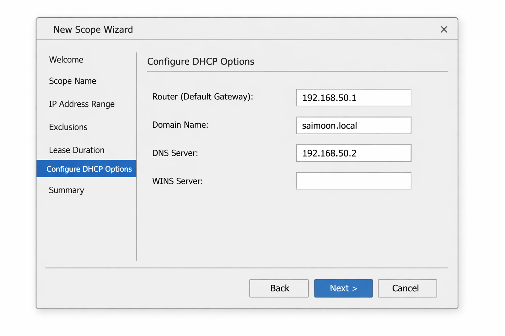

# Windows Server 2022 DHCP Setup Guide

This document describes how to deploy a DHCP (Dynamic Host Configuration Protocol) server on **Windows Server 2022** Desktop edition and configure a scope for the domain **`saimoon.local`** in a lab environment.  The screenshots used in this guide were taken from a Windows Server 2022 virtual machine; they illustrate each step of the process.

## Prerequisites

Before installing the DHCP role you should prepare your server:

* **Static IP address and domain membership** – the server that will run the DHCP service should have a static IP address and be joined to the Active Directory domain `saimoon.local`.  Without a static address the **Server Manager** wizard displays warnings when you add the DHCP role【441166533544463†L160-L163】.
* **Administrator privileges** – you must be signed in as a member of the **Administrators** group【675308123823837†L188-L197】.
* **An IP range for your scope** – decide which addresses the server will lease to clients (e.g., `192.168.50.100`–`192.168.50.200`).  Reserve addresses at the start of the subnet for network infrastructure (router, DNS servers, etc.).

## 1 – Install the DHCP Server role

1. **Open Server Manager** – click the Windows logo and launch **Server Manager**, as highlighted in the screenshot【441166533544463†L154-L163】.  
   

2. **Start the Add Roles and Features wizard** – In Server Manager, choose **Add roles and features** from the dashboard【441166533544463†L154-L163】.  
   

3. **Before you begin** – The wizard opens with a **Before you begin** page reminding you to configure prerequisites. Click **Next** to continue.  
   

4. **Select installation type** – Choose **Role‑based or feature‑based installation** and click **Next**【441166533544463†L160-L163】.  
   

5. **Select destination server** – In most lab scenarios you will select the local server from the **Server Pool** and click **Next**.  
   

6. **Select server roles** – Scroll through the list of roles and tick **DHCP Server**【441166533544463†L160-L163】.  The wizard will prompt you to add required management tools; ensure **Include management tools** is checked and click **Add Features**, then **Next**.  
     
   

7. **Complete the wizard** – Click through the **Features**, **DHCP Server**, and **Confirmation** pages, accepting defaults.  On the confirmation page, verify that **DHCP Server** is listed and click **Install**.  When the installation finishes, click **Close**.  According to Microsoft's quickstart guide, this adds the DHCP Server role and management tools without requiring a reboot【675308123823837†L203-L220】.

## 2 – Authorize the DHCP server (Active Directory environments)

After installation, Windows asks whether you want to authorize the DHCP server in Active Directory.  Authorization allows a server to respond to DHCP requests.  Use domain administrator credentials to authorize the server when prompted.  You can also authorize later from the DHCP console (right‑click the server and choose **Authorize**).

## 3 – Create a DHCP scope

A **scope** defines the range of IP addresses and options the DHCP server will allocate to clients.  Use the following steps to create a scope named **`SaimoonScope`** for the domain `saimoon.local`.

1. **Open the DHCP console** – In Server Manager, select **Tools > DHCP**.  Expand the server name and right‑click **IPv4** and choose **New Scope**【441166533544463†L169-L171】.

2. **Scope name and description** – The New Scope Wizard opens.  Enter a name like `SaimoonScope` and an optional description, then click **Next**【441166533544463†L175-L176】.  
   

3. **IP address range** – Specify the **Start IP address** (`192.168.50.100`) and **End IP address** (`192.168.50.200`), and set the **Subnet mask** (255.255.255.0).  Optionally define **Exclusion ranges** (e.g., `192.168.50.1`–`192.168.50.50`) to prevent the server from leasing addresses reserved for your router or servers【441166533544463†L185-L189】.  Click **Next**.  
   

4. **Lease duration** – Choose a lease duration appropriate for your environment.  PDQ recommends longer leases for wired devices and shorter leases for wireless devices【441166533544463†L196-L203】.  For a typical lab you can accept the default of 8 days.  Click **Next**.

5. **Configure DHCP options** – The wizard asks if you want to configure options such as gateway and DNS.  Select **Yes, I want to configure these options now** and click **Next**【675308123823837†L360-L369】.

6. **Router (Default Gateway)** – Enter the IP address of your router (e.g., `192.168.50.1`) and click **Add**【675308123823837†L368-L376】.  Click **Next**.

7. **Domain Name and DNS Servers** – Specify the **Parent domain** as `saimoon.local` and add the IP address of your DNS server (e.g., `192.168.50.2`)【675308123823837†L368-L377】.  If your DHCP server is also your DNS server, use its IP address.  Click **Add** to place the server in the list, then click **Next**.  
   

8. **WINS Servers** – If you have WINS servers, enter them on the next page; otherwise click **Next**【675308123823837†L379-L381】.

9. **Activate the scope** – Choose **Yes, I want to activate this scope now** so the DHCP server begins leasing addresses immediately【675308123823837†L383-L386】.  Click **Next** then **Finish**【675308123823837†L383-L388】.

When the wizard closes, you should see the `SaimoonScope` listed under **IPv4** in the DHCP console.  Clients on the `saimoon.local` network will now obtain IP addresses automatically from the range `192.168.50.100`–`192.168.50.200`, use `192.168.50.1` as their default gateway, and register in DNS using the `saimoon.local` domain name.

## 4 – Verify and manage DHCP

* **Address leases** – Under your scope, expand **Address Leases** to view active leases.  Right‑click a lease and choose **Add to Reservation** if you want to assign the address permanently to a device【675308123823837†L424-L441】.
* **Scope options** – You can modify or add options later by right‑clicking **Scope Options** and selecting **Configure Options**【675308123823837†L408-L417】.
* **Exclusions** – To adjust exclusion ranges after the scope is created, right‑click **Address Pool** and choose **New Exclusion Range**【675308123823837†L464-L474】.

## Repository structure

This project includes both documentation and images.  The following structure is recommended for your GitHub repository:

```text
dhcp_project/
├─ README.md           – overview of the project and file locations
├─ docs/
│  └─ setup_dhcp.md    – this step‑by‑step DHCP installation guide
└─ images/
   ├─ step1.jpg … step7.jpg  – screenshots of the Add Roles and Features wizard
   ├─ scope_step1.png         – generated graphic for scope name page
   ├─ scope_step2.png         – generated graphic for address range page
   └─ scope_step3.png         – generated graphic for DHCP options page
```

Place this `docs/setup_dhcp.md` and the `images` folder in your GitHub repository so that the relative links in the document resolve correctly.  The `README.md` file in the repository root should describe the purpose of the project and point readers to this guide.